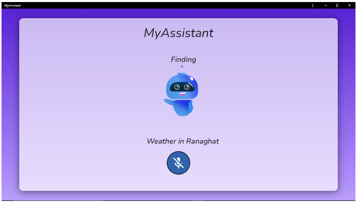
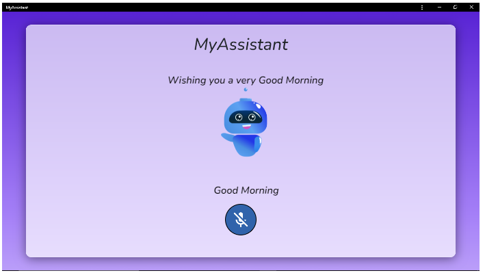

<html><head><meta content="text/html; charset=UTF-8" http-equiv="content-type"></head>

<body class="c4 doc-content">
<h1> <b> MyAssistant-Desktop-Client </b>

A voice assistant app made in React.js and Express.js
</h1>
<h1>
<a href="https://myassistantweb.netlify.app/" >Give it a Look</a>
</h1>

The rapid file sharing, improved user experience, and seamless working experience are all features of the MyAssistant Web edition. This web application has a simple layout and a few unique features.

Users can sign in and access their accounts without interruption. Ask anything, and the answer will appear in front of you in a matter of seconds when using a single voice command to search the web.

The application has features for browsing the web, listening to music, surfing YouTube, sharing files, and many more. Users can transfer files between any device and their mobile devices. Users can upload files from their mobile devices with a straightforward voice command, and they can retrieve those files directly on any device by utilizing the web application.

The Web version of MyAssistant is undoubtedly specifically made for fast, fluid working experiences, easy file sharing, and improved experience. Contrary to what is generally believed, this web application has several interesting features and a fairly minimalist style. Users can access their accounts and essentially have an uninterrupted experience, which is important. Users may connect to their accounts and essentially have an uninterrupted experience in a subtle way by just asking anything on the internet with a single voice command. The majority of the time, the answer will appear in front of you in a matter of seconds.

Users can enroll in their account and essentially enjoy an uninterrupted experience in a very significant fashion by browsing the internet, playing music, surfing youtube, exchanging files, and doing a lot more within the application. Users can transfer files from mobile devices to any other device, demonstrating how this web application is equipped with a notably simple style and a few subtly unique capabilities. Users can upload files from their mobile devices using a fundamentally straightforward voice command, and they can download those files instantly on any device by utilizing the web application, so this web application essentially has a minimalistic design.

## Screenshots
As you open the application this page is displayed on the screen as shown below.

The home contains the registration card which is the first step to getting access to the application. The user gives a valid email ID and a strong password that will be safely remembered by MyAssistant and by the user himself. If the user login successfully they can use all the features on the site.

This page is the home page of MyAssistant which is accessible only and only if the user login successfully. The cute bot will welcome you by waving. To access the Assistant the user needs to tap the mic and speak whatever they want. The mic will recognize the voice of the user and will work on the respective task. &nbsp;

The user needs to command &ldquo;Browse my files&rdquo; or &ldquo;View my file&rdquo; and a page will be displayed with all your files in the database. You can fetch and download your files by asking the Assistant through the mic. 

If there is no file attached then the user will be notified as &ldquo; No files uploaded yet&rdquo; as shown above. 

And if there are files present in your database, all your files will be shown here. You can directly download these files, just by clicking on the download tab. While you are on the page if a new file is uploaded through another device just by a single refresh the new file will also display here. 

More fun commands allow the user to access the application very easily and are quite helpful in their hectic schedule. 

For instance, if you say &rdquo;hello&rdquo; the bot will simply reply &ldquo;Hi there! What&rsquo;s going on?&rdquo; These attractive features are generated to entertain the user. Just like this, you can ask your Assistant for a few more commands which will make your daily life a bit more useful.

The user can just ask the weather for a particular locality just by saying &ldquo;Weather in (name of the place)&rdquo;. This will allow the user to get information about the respective place. The Assistant will directly open a page from the browser that shows the detailed weather of the area.

If the user greets the Assistant as &ldquo;Good Morning&rdquo;, the Assistant will reply with a very good tone Wishing you a very good morning. This type of refreshing response can affect the mood of the user in a good way.

Just similar to good morning, the user can say &ldquo;Good Night&rdquo;, and the user will respond to you &ldquo;Wishing you a very good night, Sweet Dreams&rdquo; as shown above.

The user have to command to open respective applications by say &ldquo;Open (name of the application)&rdquo;, the asked task will be accessed and display the page on the screen.

You can directly play music just by a few words as your command by one tap on the mic. Just say &ldquo;Play (then the name of the song)&rdquo;. The song will be played and the user can enjoy music easily.

If you need to browse something, there is no need to go to the browser and search for the following topic by typing. Instead you can just ask your Assistant to &ldquo;What is (name of the topic you want to search)&rdquo;, the Assistant will direct you to the websites where you can get sufficient details about the searched topic.

Sometimes we need to know about some famous personalities, the user hurriedly speeks on the mic to find the details of the respective person by saying, &ldquo;Who is (name of the person)&rdquo;. A direct page will be opened giving the details of the person.
</body></html>